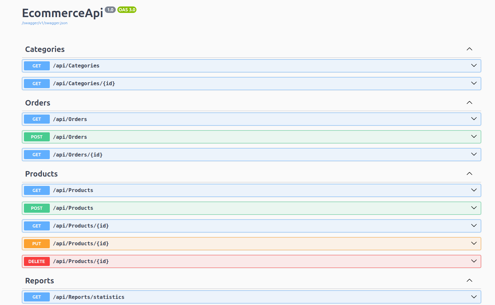
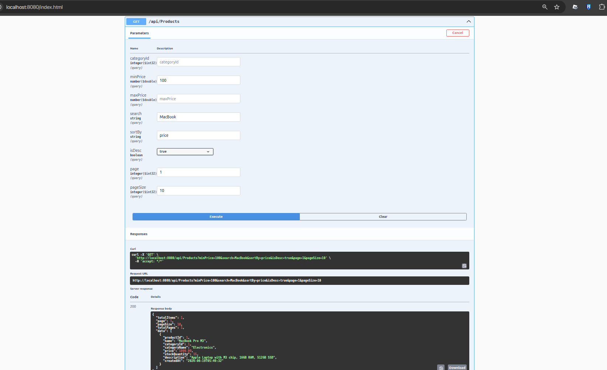
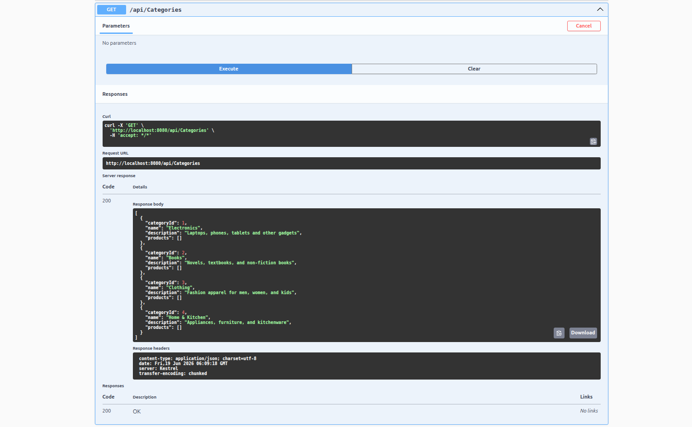
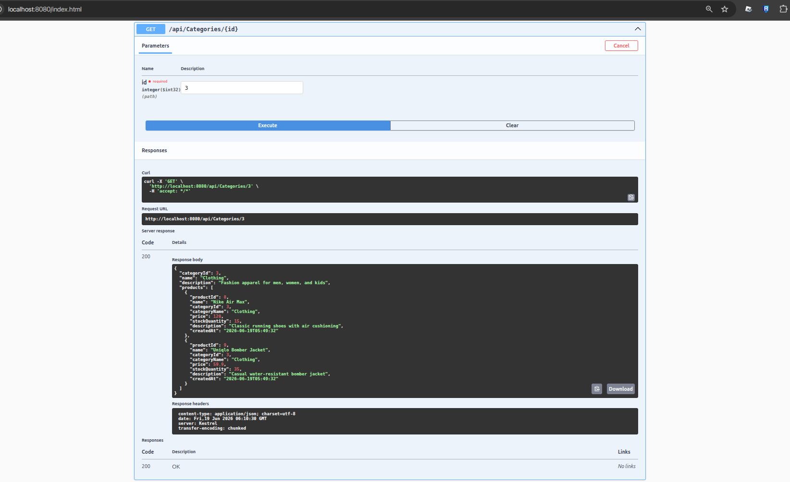
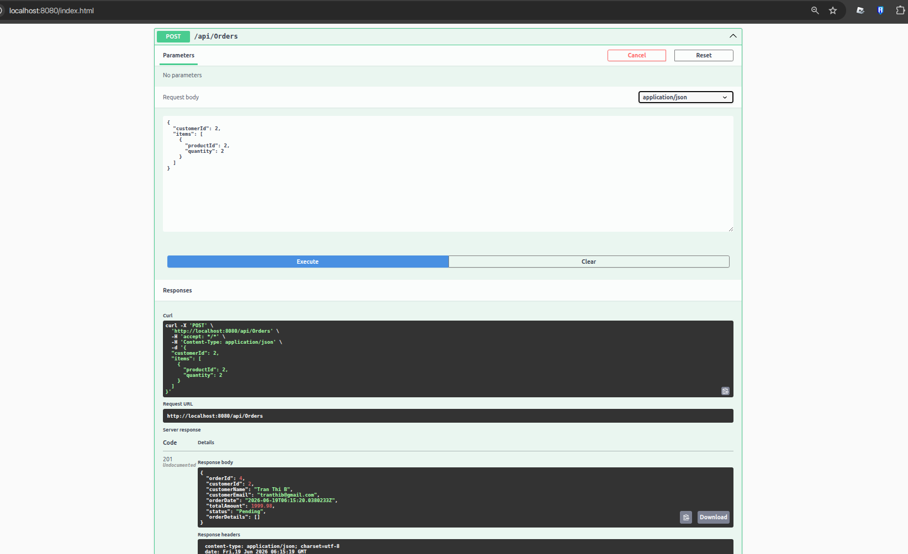
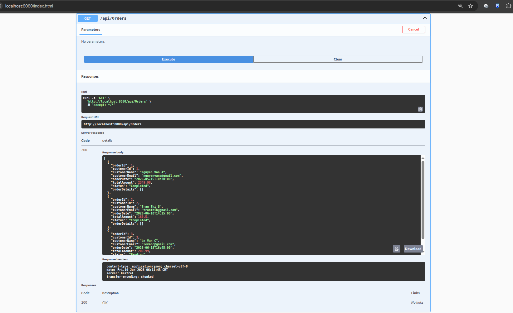
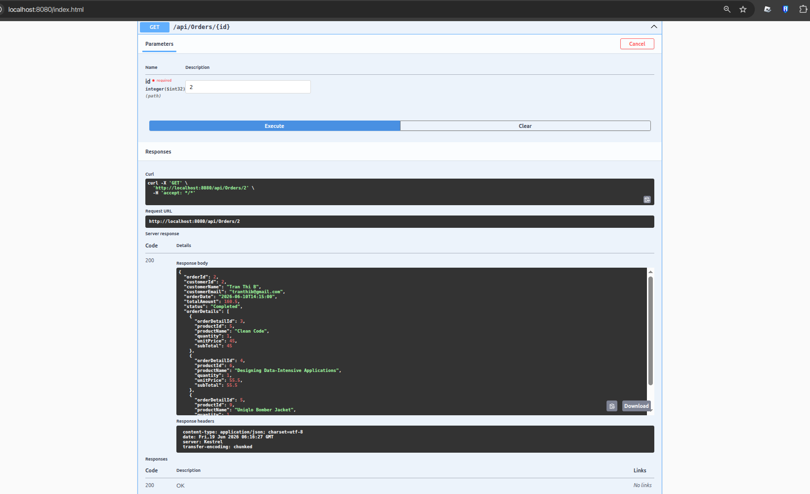
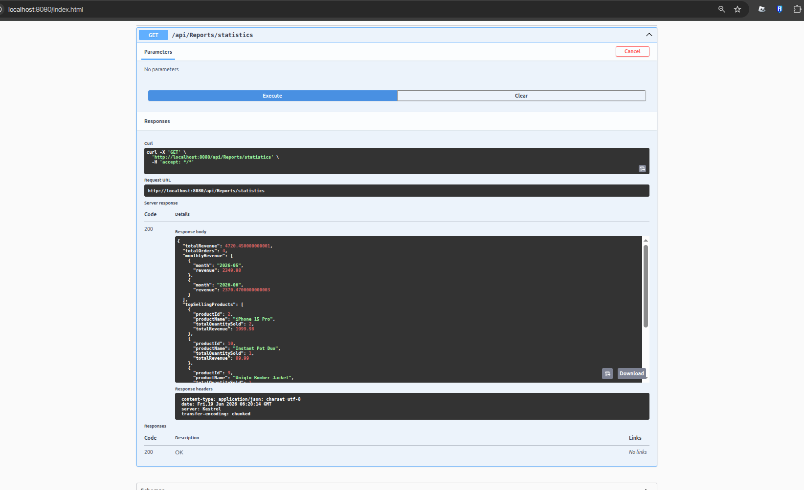

# [Daily report - 19/06/2026]

* **Họ tên:** Trà Đức Toàn
* **Nội dung nghiên cứu hôm nay:**
  1. **ASP.NET Core Web API** (Controller-based API, Middleware, Routing, Dependency Injection).
  2. **LINQ (Language Integrated Query)** (Deferred vs Immediate Execution, các toán tử nâng cao: GroupBy, Join, Select...).
  3. **Entity Framework Core (Database First)** (Cơ chế Scaffold sinh code từ DB SQLite có sẵn, Change Tracking, Transaction).
* **Tiến độ tự đánh giá:** 100% (Đã hoàn thành phần nghiên cứu lý thuyết và cài đặt thành công Mini Project chạy trên Docker, kết nối dữ liệu an toàn qua Bind Mount).
* **Issue:** Không có. (Đã xử lý xong lỗi phân quyền file do Docker sinh ra bằng `chown` và tối ưu hoá đường dẫn SQLite qua mount volume).

---

# BÁO CÁO CHI TIẾT KẾT QUẢ MINI PROJECT: E-COMMERCE API

Dự án đã được triển khai hoàn chỉnh bằng **ASP.NET Core Web API (.NET 8)**, giao tiếp dữ liệu thông qua **EF Core DB First** với cơ sở dữ liệu **SQLite** mẫu (`ecommerce.db`). Toàn bộ ứng dụng được đóng gói và chạy ổn định trên **Docker Container**.

Dưới đây là kết quả kiểm thử (test) chi tiết các API tương ứng với từng keyword nghiên cứu:

## 1. Giao diện Swagger UI của hệ thống
Giao diện quản lý trực quan hiển thị đầy đủ các Endpoints của 4 Controller phục vụ cho nghiệp vụ E-Commerce:
* **Categories:** Quản lý danh mục.
* **Orders:** Quản lý đơn hàng và chi tiết đơn hàng.
* **Products:** Quản lý sản phẩm.
* **Reports:** Phục vụ thống kê số liệu.



---

## 2. Tìm kiếm, lọc và phân trang sản phẩm (Ứng dụng LINQ Deferred Execution)
* **API:** `GET /api/Products`
* **Cơ chế:** Sử dụng cú pháp LINQ (`Where`, `OrderBy`, `Skip`, `Take`) trên đối tượng `IQueryable<Product>`. Truy vấn chỉ thực sự được dịch thành câu lệnh SQL và gửi xuống Database khi phương thức `.ToListAsync()` được gọi (Immediate Execution).
* **Hình ảnh thực tế:**
  

---

## 3. Lấy danh sách danh mục và chi tiết kèm sản phẩm (Ứng dụng EF Core Eager Loading)
* **API:** `GET /api/Categories` và `GET /api/Categories/{id}`
* **Cơ chế:** Sử dụng toán tử `.Include(c => c.Products)` của EF Core để thực hiện **Eager Loading**, tự động sinh câu lệnh SQL `JOIN` bảng `Categories` với bảng `Products` nhằm kéo thông tin sản phẩm đi kèm chỉ trong 1 lần truy vấn duy nhất.
* **Hình ảnh thực tế:**
  * **Danh sách tất cả danh mục:**
    
  * **Chi tiết danh mục kèm danh sách sản phẩm thuộc danh mục đó:**
    

---

## 4. Quản lý Đơn hàng & Xử lý Giao dịch (Ứng dụng EF Core Transaction & Change Tracking)
* **API:** `POST /api/Orders`
* **Cơ chế:** 
  * Sử dụng **EF Core Transaction** (`BeginTransactionAsync`) giúp đảm bảo toàn vẹn dữ liệu: đơn hàng được tạo thì số lượng tồn kho của từng sản phẩm bắt buộc phải được cập nhật thành công, nếu bất kỳ sản phẩm nào không đủ tồn kho (`StockQuantity`) hệ thống sẽ tự động rollback.
  * Tự động trừ số lượng sản phẩm trực tiếp nhờ cơ chế **Change Tracking** khi lưu thay đổi bằng `SaveChangesAsync()`.
* **Hình ảnh thực tế:**
  * **Thực hiện đặt hàng (POST Body):**
    
  * **Lấy danh sách các đơn hàng hiện có:**
    
  * **Xem chi tiết một đơn hàng cụ thể kèm chi tiết vật phẩm đặt mua:**
    

---

## 5. Thống kê báo cáo doanh số (Ứng dụng LINQ GroupBy & Join nâng cao)
* **API:** `GET /api/Reports/statistics`
* **Cơ chế:** 
  * Dùng LINQ gom nhóm đơn hàng theo tháng (`GroupBy(o => o.OrderDate.Value.ToString("yyyy-MM"))`) và tính tổng doanh thu (`Sum`).
  * Thực hiện **LINQ Join** giữa kết quả gom nhóm chi tiết đơn hàng bán chạy nhất với bảng sản phẩm để lấy thông tin hiển thị chính xác.
* **Hình ảnh thực tế:**
  

---

## 💻 HƯỚNG DẪN CHẠY DỰ ÁN TRÊN MÁY LOCAL

### Cách 1: Sử dụng Docker Compose (Khuyên dùng)
Bạn chỉ cần mở Terminal tại thư mục `aspdotnet-learning_19-6/` và chạy lệnh:
```bash
docker compose up --build -d
```
Sau đó truy cập **[http://localhost:8080](http://localhost:8080)** để mở Swagger UI.

### Cách 2: Chạy trực tiếp bằng .NET SDK
Nếu máy có cài sẵn .NET 8.0 SDK:
1. Mở Terminal tại `aspdotnet-learning_19-6/EcommerceApi/`.
2. Khôi phục packages và chạy dự án:
   ```bash
   dotnet restore
   dotnet run
   ```
3. Truy cập địa chỉ hiển thị trên terminal (thường là `http://localhost:5000` hoặc `http://localhost:5123`).
