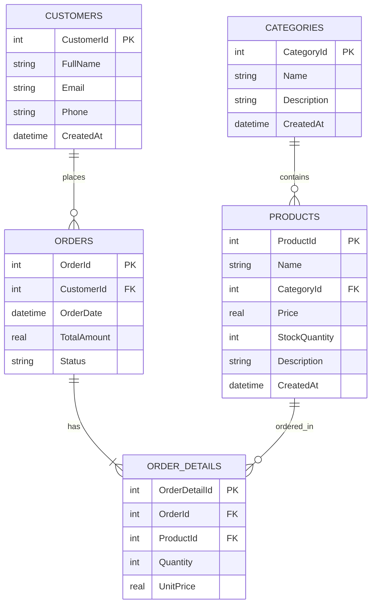

# RESEARCH: ASP.NET CORE WEB API, LINQ & ENTITY FRAMEWORK CORE (DB FIRST)

**Họ tên:** Trà Đức Toàn  
**Ngày nghiên cứu:** 19/06/2026  
**Chủ đề:** ASP.NET Core Web API, LINQ, Entity Framework Core (Database First)

---

# 1. ASP.NET Core Web API

## 1.1. Khái niệm và Mục đích sử dụng
**ASP.NET Core Web API** là một framework mạnh mẽ, mã nguồn mở, đa nền tảng (Cross-platform) của Microsoft được thiết kế để xây dựng các dịch vụ RESTful (HTTP Services).
* **Mục đích:** Xây dựng phần backend cung cấp dữ liệu (dưới dạng JSON/XML) cho các ứng dụng client như Web SPA (React, Angular, Vue), ứng dụng Mobile (iOS, Android, MAUI), hoặc tích hợp với các hệ thống bên thứ ba qua các API Endpoint.

## 1.2. Các thành phần và Cơ chế cốt lõi

### 1.2.1. Controller-based API vs Minimal API
ASP.NET Core cung cấp hai cách tiếp cận chính để xây dựng API:

| Đặc điểm | Controller-based API | Minimal API |
|---|---|---|
| **Cấu trúc** | Sử dụng các class kế thừa từ `ControllerBase` với các Attribute như `[ApiController]`, `[Route]`. | Định nghĩa API trực tiếp trong file `Program.cs` thông qua các phương thức `MapGet`, `MapPost`... |
| **Độ phức tạp** | Phù hợp với các hệ thống lớn, nhiều controller, cần cấu trúc chặt chẽ và chia tách module rõ ràng. | Phù hợp với các dịch vụ nhỏ (microservices), ứng dụng nhẹ, hoặc khi cần tối ưu hiệu năng khởi động. |
| **Tổ chức code** | Rõ ràng nhưng tốn nhiều file và boilerplate code. | Gọn nhẹ, trực quan nhưng dễ gây lộn xộn nếu dự án phình to (cần kỹ thuật chia nhỏ endpoints). |

### 1.2.2. Middleware Pipeline (Luồng xử lý HTTP Request)
Middleware là các thành phần phần mềm được lắp ráp vào một pipeline (đường ống) của ứng dụng để xử lý các request và response.
* Mỗi middleware có thể chọn chuyển request sang middleware tiếp theo trong pipeline hoặc xử lý xong và trả về response luôn (ngắt pipeline - short-circuiting).
* **Thứ tự đăng ký middleware** trong file `Program.cs` cực kỳ quan trọng vì HTTP request sẽ đi qua chúng theo thứ tự đó và quay lại theo thứ tự ngược lại.
* *Các middleware phổ biến:* Exception Handling, HttpsRedirection, StaticFiles, Routing, CORS, Authentication, Authorization, Custom Middleware.

```text
HTTP Request  ──> [ Exception Handler ] ──> [ CORS ] ──> [ Authentication ] ──> [ Routing ] ──> Controller/Endpoint
                                                                                                    │
HTTP Response <── [ Exception Handler ] <── [ CORS ] <── [ Authentication ] <── [ Routing ] <── ────┘
```

### 1.2.3. Dependency Injection (DI)
ASP.NET Core tích hợp sẵn container chứa và quản lý các Dependency Injection (IoC Container). DI giúp giảm sự phụ thuộc cứng nhắc giữa các class, tăng khả năng bảo trì và viết Unit Test.
Có 3 loại Lifetimes chính của Service đăng ký trong DI:
1. **Transient (`AddTransient`):** Tạo ra một instance mới mỗi lần service được yêu cầu (phù hợp cho các service nhẹ, stateless).
2. **Scoped (`AddScoped`):** Tạo ra một instance mới cho mỗi HTTP request. Instance này được chia sẻ chung trong toàn bộ các thành phần xử lý request đó (thường dùng nhất cho `DbContext`, `Repositories`, `Services`).
3. **Singleton (`AddSingleton`):** Chỉ tạo một instance duy nhất vào lần yêu cầu đầu tiên và dùng chung cho toàn bộ vòng đời của ứng dụng.

### 1.2.4. Routing, Model Binding và Model Validation
* **Routing:** Cơ chế định tuyến HTTP request đến đúng Controller Action hoặc Endpoint. Có hai loại: *Attribute Routing* (sử dụng trên Controller/Action như `[Route("api/[controller]")]`) và *Conventional Routing* (cấu hình mẫu route chung).
* **Model Binding:** Tự động map dữ liệu từ HTTP Request (Query String, Route values, Request Body, Headers, Form data) vào các tham số của Action Method.
* **Model Validation:** Kiểm tra tính hợp lệ của dữ liệu đầu vào sử dụng các attribute trong namespace `System.ComponentModel.DataAnnotations` (như `[Required]`, `[StringLength]`, `[EmailAddress]`).

---

# 2. LINQ (Language Integrated Query)

## 2.1. Khái niệm và Mục đích
**LINQ** là một tập hợp các tính năng được tích hợp sâu vào ngôn ngữ C# từ phiên bản 3.0, cho phép viết các câu truy vấn trực tiếp trên các nguồn dữ liệu khác nhau (Collections, XML, SQL Databases) bằng cú pháp nhất quán, có kiểm tra kiểu dữ liệu tĩnh (compile-time type checking) và hỗ trợ gợi ý code (IntelliSense).

## 2.2. Hai loại Cú pháp truy vấn (Syntax Styles)
1. **Query Syntax (Cú pháp giống SQL):**
   ```csharp
   var query = from p in products
               where p.Price > 100
               select p;
   ```
2. **Method Syntax (Cú pháp Lambda / Fluent - được khuyên dùng):**
   ```csharp
   var query = products.Where(p => p.Price > 100);
   ```

## 2.3. Deferred Execution (Thực thi trì hoãn) vs Immediate Execution (Thực thi ngay lập tức)

Đây là khái niệm cực kỳ quan trọng khi làm việc với LINQ, đặc biệt là với Entity Framework:

* **Deferred Execution (Trì hoãn):** Câu lệnh LINQ chỉ định nghĩa *kế hoạch* truy vấn chứ chưa thực thi lấy dữ liệu ngay. Dữ liệu chỉ thực sự được lấy ra khi ta bắt đầu duyệt qua kết quả (ví dụ dùng vòng lặp `foreach`, gọi `.ToList()`, `.ToArray()`, `.FirstOrDefault()`).
  * Trả về các kiểu dữ liệu như `IEnumerable<T>` hoặc `IQueryable<T>`.
  * *Ưu điểm:* Có thể tiếp tục xây dựng, chắp nối câu lệnh truy vấn mà không cần truy cập Database nhiều lần.
* **Immediate Execution (Thực thi ngay):** Câu lệnh LINQ ép buộc thực thi truy vấn ngay lập tức tại dòng code đó và trả về kết quả cụ thể.
  * Được kích hoạt bởi các hàm chuyển đổi như: `.ToList()`, `.ToArray()`, `.ToDictionary()`, hoặc các hàm trả về một giá trị duy nhất như `.Count()`, `.First()`, `.FirstOrDefault()`, `.Sum()`, `.Any()`.

### IQueryable<T> vs IEnumerable<T>
* **IEnumerable<T>:** Dành cho dữ liệu trong bộ nhớ (In-memory collection). Các bộ lọc LINQ (Where, Select...) sẽ được thực thi trên RAM của server ứng dụng sau khi đã kéo toàn bộ dữ liệu về.
* **IQueryable<T>:** Dành cho các nguồn dữ liệu ngoài ứng dụng (như Database). Câu lệnh LINQ được biên dịch thành SQL Query (bởi EF Core) và gửi xuống Database để thực thi lọc, sắp xếp, gom nhóm. Server chỉ nhận về tập kết quả đã qua bộ lọc, giúp tối ưu hóa băng thông và hiệu năng hệ thống một cách tối đa.

## 2.4. Các toán tử LINQ phổ biến nhất
* `.Where(predicate)`: Lọc các phần tử theo điều kiện.
* `.Select(selector)`: Ánh xạ (projection) các phần tử sang một kiểu dữ liệu mới (ví dụ chuyển Entity thành DTO).
* `.SelectMany(selector)`: Làm phẳng (flatten) các collection lồng nhau.
* `.OrderBy() / .OrderByDescending()`: Sắp xếp tăng dần / giảm dần.
* `.ThenBy() / .ThenByDescending()`: Sắp xếp thứ cấp.
* `.GroupBy(keySelector)`: Nhóm các phần tử theo khóa.
* `.Join()`: Kết hợp hai nguồn dữ liệu dựa trên khóa chung.
* `.FirstOrDefault(predicate)`: Lấy phần tử đầu tiên thỏa mãn điều kiện, hoặc giá trị mặc định (`null`) nếu không tìm thấy.
* `.SingleOrDefault(predicate)`: Lấy phần tử duy nhất thỏa mãn điều kiện, ném ngoại lệ nếu có từ 2 phần tử trở lên, trả về `null` nếu không có.
* `.Any(predicate)`: Kiểm tra xem có bất kỳ phần tử nào thỏa mãn điều kiện không (trả về boolean).
* `.All(predicate)`: Kiểm tra xem tất cả phần tử có thỏa mãn điều kiện không.
* `.Include() / .ThenInclude()`: (Của EF Core) Eager loading để tải các dữ liệu liên quan (Foreign Keys).

---

# 3. Entity Framework Core (Database First)

## 3.1. Khái niệm EF Core và các hướng tiếp cận
**Entity Framework Core (EF Core)** là một ORM (Object-Relational Mapper) hiện đại, nhẹ, có thể mở rộng và đa nền tảng dành cho .NET. Nó ánh xạ các bảng trong cơ sở dữ liệu quan hệ thành các class C# (Entities) và giúp lập trình viên thao tác với dữ liệu mà không cần viết các câu lệnh SQL thuần túy.

Có hai hướng tiếp cận chính:
1. **Code First:** Viết các Class Entities trong C# trước, sau đó EF Core sẽ tự sinh ra Database cấu trúc tương ứng qua cơ chế Migration.
2. **Database First:** Database đã có sẵn từ trước (hoặc được thiết kế bằng các công cụ thiết kế DB). Lập trình viên sử dụng công cụ Scaffold của EF Core để tự động tạo ra các Class Entities và `DbContext` từ Database hiện có.

## 3.2. Quy trình triển khai Database First (Scaffolding)
Để thực hiện Database First trong dự án .NET Core 8, cần làm các bước sau:

### Bước 1: Cài đặt các gói NuGet cần thiết vào project
* `Microsoft.EntityFrameworkCore` (Core ORM)
* `Microsoft.EntityFrameworkCore.Design` (Hỗ trợ chạy các công cụ CLI như scaffold)
* Gói Provider tương ứng của Database, ví dụ:
  * `Microsoft.EntityFrameworkCore.Sqlite` (dành cho SQLite)
  * `Microsoft.EntityFrameworkCore.SqlServer` (dành cho SQL Server)
  * `Npgsql.EntityFrameworkCore.PostgreSQL` (dành cho PostgreSQL)

### Bước 2: Sử dụng Command Line để Scaffold Database
Sử dụng lệnh `dotnet ef dbcontext scaffold` để quét cấu trúc database và sinh code.

**Cú pháp chung:**
```bash
dotnet ef dbcontext scaffold "ConnectionString" ProviderPackage -o OutputDirectory
```

**Ví dụ cụ thể với SQLite:**
```bash
dotnet ef dbcontext scaffold "Data Source=ecommerce.db" Microsoft.EntityFrameworkCore.Sqlite -o Models --context EcommerceContext --force
```
*Lưu ý:* Cần cài đặt tool toàn cục `dotnet-ef` bằng lệnh `dotnet tool install --global dotnet-ef` nếu chạy trực tiếp trên máy chủ vật lý.

## 3.3. DbContext và DbSet là gì?
* **`DbContext`:** Đóng vai trò là một session làm việc với Database. Nó là cầu nối chính chịu trách nhiệm kết nối, truy vấn dữ liệu, theo dõi trạng thái thay đổi (change tracking) và lưu các thay đổi xuống Database.
* **`DbSet<TEntity>`:** Đại diện cho một bảng cụ thể trong Database. Lập trình viên thực hiện các câu truy vấn LINQ trên `DbSet` này để tương tác với dữ liệu của bảng đó.

## 3.4. Change Tracking (Theo dõi thay đổi) và CRUD Operations
Khi một entity được tải lên từ `DbContext`, EF Core mặc định sẽ bật tính năng theo dõi trạng thái thay đổi của entity đó.
Các trạng thái gồm: `Added`, `Unchanged`, `Modified`, `Deleted`, `Detached`.

* **Create:**
  ```csharp
  var newProduct = new Product { Name = "Laptop Dell", Price = 1200 };
  _context.Products.Add(newProduct); // Trạng thái: Added
  await _context.SaveChangesAsync(); // Biên dịch thành lệnh INSERT, chuyển trạng thái thành Unchanged
  ```
* **Read:**
  ```csharp
  var products = await _context.Products.Where(p => p.Price > 1000).ToListAsync();
  ```
* **Update:**
  ```csharp
  var product = await _context.Products.FindAsync(1);
  if (product != null)
  {
      product.Price = 1100; // EF Core tự động phát hiện thay đổi (Trạng thái: Modified)
      await _context.SaveChangesAsync(); // Biên dịch thành lệnh UPDATE
  }
  ```
* **Delete:**
  ```csharp
  var product = await _context.Products.FindAsync(1);
  if (product != null)
  {
      _context.Products.Remove(product); // Trạng thái: Deleted
      await _context.SaveChangesAsync(); // Biên dịch thành lệnh DELETE
  }
  ```

---

# 4. Thiết kế Mini Project: E-Commerce Catalog & Order API

Để thực hành đầy đủ 3 từ khóa: **ASP.NET Core Web API**, **LINQ** và **EF Core (DB First)**, chúng ta sẽ xây dựng một API quản lý Cửa hàng điện tử thu nhỏ sử dụng Database SQLite có sẵn.

## 4.1. Sơ đồ thực thể cơ sở dữ liệu (Database Schema)
Chúng ta sẽ thiết kế một database SQLite gồm 4 bảng cốt lõi:



## 4.2. Kế hoạch triển khai mã nguồn

### Bước 1: Khởi tạo CSDL SQLite (`ecommerce.db`)
Sử dụng script SQL để tạo bảng và chèn sẵn một số bản ghi mẫu (seed data).

### Bước 2: Tạo project ASP.NET Core Web API
Tạo thư mục dự án và khởi tạo ứng dụng Web API bằng dotnet CLI.

### Bước 3: Thực hiện Scaffold Database First
Sử dụng `dotnet-ef` chạy bên trong container SDK để quét file `ecommerce.db` và tự động sinh ra các Entities (`Product`, `Category`, `Customer`, `Order`, `OrderDetail`) cùng với `EcommerceContext`.

### Bước 4: Viết API Endpoints (Sử dụng cả Controller-based và LINQ nâng cao)
1. **Category & Product Endpoints:**
   - Lấy danh sách sản phẩm phân trang, lọc theo giá, tìm kiếm theo tên và theo Category (sử dụng LINQ `Where`, `OrderBy`, `Skip`, `Take`).
   - Lấy chi tiết Category đi kèm danh sách sản phẩm thuộc category đó (sử dụng LINQ `Include` eager loading).
2. **Customer & Order Endpoints:**
   - Tạo đơn hàng mới (`POST /api/orders`): Thực hiện Transaction, kiểm tra số lượng tồn kho sản phẩm, tự động tính tổng tiền và trừ số lượng sản phẩm trong kho.
   - Thống kê doanh thu và báo cáo bán hàng (`GET /api/reports/statistics`): Sử dụng LINQ `GroupBy`, `Sum`, `Join` nâng cao để tính tổng doanh thu theo từng tháng và thống kê sản phẩm bán chạy nhất.

### Bước 5: Cấu hình Docker
Xây dựng file `Dockerfile` và `docker-compose.yml` để đóng gói toàn bộ ứng dụng gồm Web API, file SQLite Database, cấu hình Swagger chạy trực quan để dễ dàng test.

---

# 5. Khó khăn dự kiến và Cách khắc phục
1. **Thiết lập tool `dotnet-ef` trong môi trường Docker:** Vì trên máy host không cài sẵn .NET SDK, chúng ta sẽ thực thi lệnh scaffold bằng cách chạy một container dùng ảnh `mcr.microsoft.com/dotnet/sdk:8.0` gắn kèm workspace làm ổ đĩa ảo (Volume) và thực hiện cài đặt công cụ cục bộ/toàn cục trong container.
2. **Lỗi khóa ngoại và Quan hệ vòng trong DB First:** Khi scaffold, EF Core sẽ tự động tạo các Navigation Properties (ví dụ: `Product.Category` và `Category.Products`). Khi trả về JSON trực tiếp từ Controller, điều này có thể gây ra lỗi lặp vòng vô hạn (Object cycle error). Khắc phục bằng cách cấu hình JSON serializer bỏ qua quan hệ vòng hoặc tối ưu nhất là chuyển sang dùng **DTO (Data Transfer Object)**.
3. **Quản lý SQLite Database File trong Docker:** File database `.db` cần được đặt ở thư mục chia sẻ để tránh việc bị ghi đè hoặc mất dữ liệu khi restart container.
