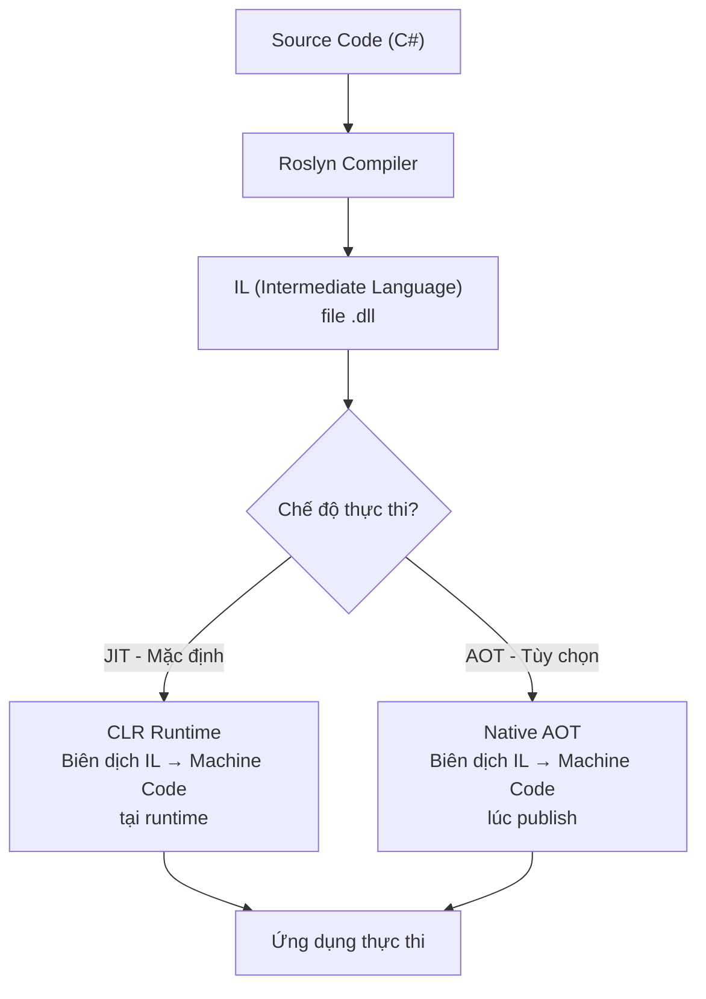

# RESEARCH .NET 8

**Họ tên:** Trà Đức Toàn  
**Ngày nghiên cứu:** 18/06/2026  
**Chủ đề:** .NET 8  

---

# 1. Giới thiệu tổng quan

.NET 8 là phiên bản **Long-Term Support (LTS)** của nền tảng phát triển ứng dụng mã nguồn mở do Microsoft phát hành vào **tháng 11/2023**, được hỗ trợ chính thức trong **3 năm** (đến tháng 11/2026).

> Theo tài liệu chính thức: ".NET 8 is the successor to .NET 7. It will be supported for three years as a long-term support (LTS) release."  
> — [Microsoft Learn: What's new in .NET 8](https://learn.microsoft.com/en-us/dotnet/core/whats-new/dotnet-8/overview)

.NET 8 hỗ trợ **đa nền tảng (Cross Platform)**: Windows, Linux, macOS — giúp lập trình viên tự do phát triển và triển khai trên máy chủ vật lý, máy ảo, container hoặc các dịch vụ Cloud lớn.

---

# 2. .NET 8 dùng để làm gì?

.NET 8 được sử dụng để xây dựng nhiều loại ứng dụng khác nhau, nhưng trong môi trường doanh nghiệp, .NET thường được dùng nhiều nhất cho **Backend API, Web Application và Microservices**.

Một hệ thống doanh nghiệp tiêu biểu thường sử dụng .NET 8 theo mô hình:

```text
Frontend Web/Mobile (React, Angular, iOS, Android...)
        ↓
ASP.NET Core Web API (Routing, Auth, Controllers)
        ↓
Service Layer (Business Logic, Validation)
        ↓
Entity Framework Core (ORM Mapper)
        ↓
SQL Server / PostgreSQL / MySQL
```

### Các ví dụ ứng dụng thực tế:
* **Hệ thống quản lý nhân sự (HRM)**
* **Hệ thống quản lý đơn hàng & chuỗi cung ứng**
* **Website Thương mại điện tử quy mô lớn**
* **Hệ thống lõi ngân hàng (Core Banking), Cổng thanh toán**
* **Hệ thống ERP (Quản trị nguồn lực doanh nghiệp) / CRM**
* **Hệ thống quản lý kho vận (Logistics)**

Trong dự án thực tế, .NET 8 đóng vai trò backend chính, đảm nhiệm xử lý API, authentication/authorization, tính toán nghiệp vụ phức tạp, kết nối database bảo mật và được đóng gói deploy qua Docker/Kubernetes.

---

# 3. Hệ sinh thái .NET 8

Một điểm cực kỳ quan trọng là phải phân biệt được **ASP.NET Core không phải là toàn bộ .NET**, mà chỉ là một framework con phục vụ cho mảng Web nằm trong bức tranh hệ sinh thái rộng lớn của .NET:

```text
.NET 8
│
├── C#                    Ngôn ngữ lập trình chính (phiên bản C# 12)
├── CLR                   Common Language Runtime - môi trường chạy ứng dụng
├── BCL                   Base Class Library - tập hợp thư viện chuẩn (File, Collection...)
├── ASP.NET Core          Framework chuyên dùng để xây dựng Web App và Web API
├── Entity Framework Core ORM dùng để tương tác với Database bằng đối tượng C#
├── .NET MAUI             Framework build ứng dụng Mobile (iOS/Android) và Desktop (Windows/macOS)
├── Blazor                Framework xây dựng giao diện Web UI tương tác bằng C# thay vì Javascript
└── .NET Aspire           Stack hỗ trợ phát triển Cloud-native & điều phối các Microservices
```

---

# 4. Lịch sử phát triển

Microsoft đã trải qua nhiều giai đoạn thay đổi nền tảng:

| Phiên bản | Năm | Ghi chú |
|---|---|---|
| .NET Framework 1.0 | 2002 | Chỉ chạy trên Windows, đóng nguồn |
| .NET Core 1.0 | 2016 | Bắt đầu chuyển sang mã nguồn mở, hỗ trợ Cross-Platform |
| .NET Core 3.1 | 2019 | Bản LTS cuối cùng mang thương hiệu "Core" |
| .NET 5 | 2020 | Bắt đầu lộ trình đồng nhất các nhánh phát triển |
| .NET 6 (LTS) | 2021 | Hỗ trợ C# 10, Minimal API |
| .NET 7 | 2022 | Hỗ trợ C# 11, cải tiến hiệu năng |
| **.NET 8 (LTS)** | **2023** | **Bản LTS hiện tại, tối ưu hóa cloud-native và Native AOT** |

> **Lưu ý quan trọng về lịch sử đặt tên:** Từ .NET 5, Microsoft thống nhất hướng phát triển tương lai dưới tên gọi ".NET". Tuy nhiên, .NET Framework truyền thống vẫn tồn tại riêng cho các hệ thống cũ trên Windows, còn .NET 5 trở đi là nền tảng hiện đại, cross-platform và được khuyến nghị cho các dự án mới.

---

# 5. Kiến trúc hoạt động của .NET 8



1. Lập trình viên viết mã nguồn bằng **C#**.
2. Trình biên dịch **Roslyn** chuyển mã nguồn thành mã trung gian **IL (Intermediate Language)** đóng gói dưới dạng file `.dll`.
3. Khi chạy ứng dụng, **CLR (Common Language Runtime)** sẽ biên dịch IL thành mã máy (Machine Code) để thực thi trên OS tương ứng (JIT). Ngoài ra .NET 8 hỗ trợ biên dịch trực tiếp ra mã máy tại thời điểm build (AOT).

---

# 6. Các thành phần chính

### 6.1. Common Language Runtime (CLR)
CLR là nhân tố cốt lõi của .NET, quản lý vòng đời chạy của ứng dụng:
* **Garbage Collection (GC):** Tự động dọn dẹp bộ nhớ. .NET 8 tối ưu hóa Generational GC và hỗ trợ điều chỉnh giới hạn bộ nhớ động thông qua API `GC.RefreshMemoryLimit()`.
* **Thread Management:** Quản lý hàng đợi luồng để tối ưu hóa xử lý bất đồng bộ (async/await).
* **Exception Handling:** Quản lý cơ chế try-catch lỗi thống nhất.
* **Security:** Hỗ trợ type safety, quản lý assembly loading, cryptography API và tích hợp với cơ chế authentication/authorization ở ASP.NET Core.

### 6.2. Base Class Library (BCL)
BCL cung cấp sẵn tập hợp các API nền tảng để làm việc với:
* Thao tác File, Network, Collection (List, Dictionary, Array).
* Xử lý chuỗi JSON (System.Text.Json).
* Logging, Cryptography, Async Tasks.

---

# 7. Các tính năng mới quan trọng trong .NET 8

## 7.1. C# 12 — Ngôn ngữ lập trình ngắn gọn hơn
* **Primary Constructors:** Áp dụng cho class/struct giúp inject service ngắn hơn:
  ```csharp
  public class UserService(ILogger logger) 
  {
      public void DoWork() => logger.LogInformation("Working...");
  }
  ```
* **Collection Expressions:** Khai báo collection bằng cú pháp `[...]`:
  ```csharp
  int[] numbers = [1, 2, 3];
  List<string> fruits = ["Apple", "Banana"];
  int[] combined = [.. numbers, 4, 5]; // spread operator
  ```
* **Alias Any Type:** Định nghĩa bí danh cho bất cứ kiểu dữ liệu nào (ví dụ: Tuple):
  ```csharp
  using Point = (int X, int Y);
  ```
* **Default Lambda Parameters:**
  ```csharp
  var greet = (string name = "World") => $"Hello, {name}";
  ```

## 7.2. Native AOT (Ahead-of-Time compilation)
Biên dịch ứng dụng thẳng ra mã máy, loại bỏ sự phụ thuộc vào JIT và không cần đóng gói CLR khi chạy:
* **Ưu điểm:** Khởi động cực nhanh (milliseconds), giảm RAM sử dụng, file output nhẹ hơn.
* **Nhược điểm:** Không dùng được Reflection động.

## 7.3. TimeProvider Abstraction
Cung cấp lớp `TimeProvider` giúp viết Unit Test giả lập thời gian (mock time) dễ dàng hơn thay vì dùng `DateTime.Now` trực tiếp.

## 7.4. Keyed Dependency Injection Services
Đăng ký service theo định danh (key), giải quyết trường hợp 1 interface có nhiều implementation:
```csharp
builder.Services.AddKeyedSingleton<IMessageService, EmailService>("email");
builder.Services.AddKeyedSingleton<IMessageService, SmsService>("sms");
```

## 7.5. Frozen Collections
Thêm `FrozenDictionary` và `FrozenSet` dành riêng cho các tập dữ liệu chỉ đọc (read-only) sau khi khởi tạo. Cải thiện hiệu năng lookup đáng kể.

## 7.6. Performance Improvements
* **Dynamic PGO (Profile-Guided Optimization):** Bật mặc định giúp tăng trung bình 15% hiệu năng runtime.
* **Tối ưu hóa GC:** Hỗ trợ điều chỉnh cứng Heap limit tại runtime.

---

# 8. Cấu trúc dự án .NET Web API

Cấu trúc thư mục phổ biến cho một project ASP.NET Core Web API:

```text
MyApi/
├── Controllers/          # Nơi định nghĩa các API routes và tiếp nhận request
├── Models/               # Định nghĩa các Data Transfer Object (DTO) hoặc Entity
├── Services/             # Chứa logic nghiệp vụ (Business Logic) của ứng dụng
├── Repositories/         # Nơi tương tác trực tiếp với Database (EF Core)
├── Program.cs            # Entry point cấu hình Service Container (DI) và Middleware Pipeline
├── appsettings.json      # File cấu hình (Connection String, JWT, Log level...)
├── Dockerfile            # Cấu hình container hóa ứng dụng
└── MyApi.csproj          # File quản lý package, target framework của project
```

---

# 9. Demo thực hành: Minimal API + Docker

Dưới đây là demo một ứng dụng Minimal API sử dụng .NET 8, C# 12 (Primary Constructor, Collection Expression, TimeProvider), tích hợp **Swagger** để hiển thị giao diện test trực quan trên browser và Dockerfile tối ưu.

## 9.1. Source Code `Program.cs`
```csharp
var builder = WebApplication.CreateBuilder(args);

// 1. Thêm Swagger/Endpoints Explorer vào Service Container (DI)
builder.Services.AddEndpointsApiExplorer();
builder.Services.AddSwaggerGen();

var app = builder.Build();

// 2. Cấu hình HTTP Request Pipeline (Middleware) để dùng Swagger
app.UseSwagger();
app.UseSwaggerUI(c =>
{
    c.SwaggerEndpoint("/swagger/v1/swagger.json", "Demo API .NET 8 V1");
    c.RoutePrefix = string.Empty; // Hiển thị Swagger trực tiếp tại trang chủ http://localhost:8080/
});

// Endpoint 1: Health check dùng TimeProvider của .NET 8
app.MapGet("/health", () => Results.Ok(new
{
    Status = "Healthy",
    Timestamp = TimeProvider.System.GetUtcNow(),
    Environment = app.Environment.EnvironmentName
}));

// Endpoint 2: Sử dụng C# 12 Collection Expressions
app.MapGet("/demo/collections", () =>
{
    int[] numbers = [1, 2, 3, 4, 5];
    List<string> fruits = ["Apple", "Banana", "Cherry"];
    int[] combined = [.. numbers, 6, 7, 8];

    return Results.Ok(new { numbers, fruits, combined });
});

// Endpoint 3: Sử dụng C# 12 Primary Constructor
app.MapGet("/demo/user/{name}", (string name) =>
{
    var user = new UserDto(name, "intern@company.com");
    return Results.Ok(user);
});

app.Run();

// Class DTO sử dụng Primary Constructor (C# 12)
public class UserDto(string name, string email)
{
    public string Name { get; } = name;
    public string Email { get; } = email;
    public DateTime CreatedAt { get; } = DateTime.UtcNow;
}
```

## 9.2. Dockerfile (Multi-stage Build)
```dockerfile
# Stage 1: Build & Publish code
FROM mcr.microsoft.com/dotnet/sdk:8.0 AS build
WORKDIR /src
COPY *.csproj .
RUN dotnet restore
COPY . .
RUN dotnet publish -c Release -o /app/publish

# Stage 2: Chạy ứng dụng bằng Runtime cực nhẹ
FROM mcr.microsoft.com/dotnet/aspnet:8.0 AS runtime
WORKDIR /app
COPY --from=build /app/publish .
EXPOSE 8080
ENV ASPNETCORE_URLS=http://+:8080
ENTRYPOINT ["dotnet", "DemoApi.dll"]
```

---

# 10. Ưu điểm và nhược điểm

### Ưu điểm:
* **Hiệu năng vượt trội:** Xử lý request tốt hơn nhờ JIT cải tiến và Dynamic PGO bật mặc định.
* **Đa nền tảng thực sự:** Phát triển trên Mac/Windows/Linux và deploy dễ dàng lên mọi cloud platform.
* **Triển khai hiện đại:** Rất nhẹ khi chạy trong Docker/Kubernetes container.
* **Tính ổn định lâu dài:** Hỗ trợ LTS đến 3 năm, phù hợp với các dự án lớn của doanh nghiệp.

### Nhược điểm:
* **Hệ sinh thái lớn, học lâu:** Có quá nhiều khái niệm và framework đi kèm.
* **Native AOT còn hạn chế:** Chưa tương thích hoàn toàn với các thư viện cũ sử dụng nhiều cơ chế Reflection động.
* **Visual Studio đầy đủ:** Chỉ hỗ trợ tốt nhất trên nền tảng Windows (trên Linux/macOS phải dùng Rider hoặc VS Code).

---

# 11. Khó khăn gặp phải

1. **Phân biệt tính năng của .NET 8:** Ban đầu khó nhận biết đâu là tính năng cốt lõi của .NET 8 vì nhiều bài viết trên mạng gộp chung tất cả các phiên bản .NET Core cũ lại.
2. **Hiểu về Native AOT:** Hiểu được sự khác biệt giữa biên dịch JIT truyền thống và AOT cũng như các hạn chế về Reflection khi chuyển đổi.
3. **Cú pháp C# 12 Primary Constructor:** Dễ nhầm lẫn với cơ chế record. Lớp class thông thường sử dụng primary constructor sẽ không tự sinh ra các public properties mà parameter chỉ có scope trong class body.
4. **Setup Docker Multi-stage:** Hiểu được cơ chế hoạt động của SDK image (dung lượng lớn dùng để compile) và ASP.NET runtime image (dung lượng cực nhỏ dùng để chạy) nhằm tối ưu size image.

---

# 12. Kết luận

.NET 8 LTS là phiên bản nâng cấp mang tính chiến lược của Microsoft. Nó cung cấp tốc độ thực thi vượt trội và cú pháp C# 12 hiện đại, tối ưu cho việc đóng gói Docker. Việc nắm chắc bức tranh tổng quan và kiến trúc chạy của .NET 8 là bước đệm bắt buộc trước khi đi sâu vào nghiên cứu **ASP.NET Core Web API** để xây dựng ứng dụng backend thực tế.

---

# 13. Tài liệu tham khảo

1. [What's new in .NET 8 — Microsoft Learn](https://learn.microsoft.com/en-us/dotnet/core/whats-new/dotnet-8/overview)
2. [What's new in C# 12 — Microsoft Learn](https://learn.microsoft.com/en-us/dotnet/csharp/whats-new/csharp-12)
3. [Performance Improvements in .NET 8 — Microsoft DevBlogs](https://devblogs.microsoft.com/dotnet/performance-improvements-in-net-8/)
4. [What's new in .NET 8 Runtime — Microsoft Learn](https://learn.microsoft.com/en-us/dotnet/core/whats-new/dotnet-8/runtime)
5. [What's new in ASP.NET Core 8.0 — Microsoft Learn](https://learn.microsoft.com/en-us/aspnet/core/release-notes/aspnetcore-8.0)
