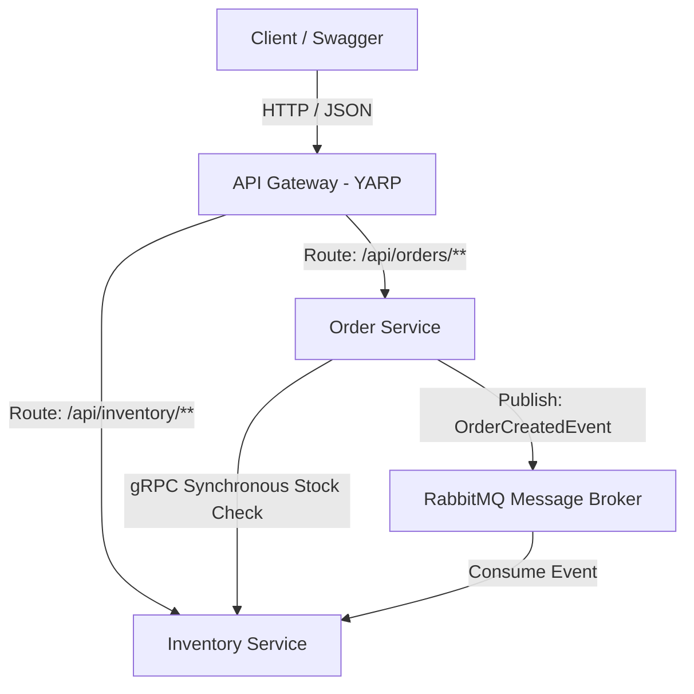

# Implementation Plan - Microservices Architecture (RabbitMQ, gRPC, API Gateway, Microservice)

This plan details the design and step-by-step creation of a Microservices-based Demo Project in `.NET 8` for the training day **24/06/2026**.

## 1. System Architecture



*   **API Gateway (YARP)**: Listens on port `8080`. Acts as the reverse proxy routing external client requests to the correct internal service.
*   **Order Service**: Web API service (port `8081` internal). Exposes REST endpoints to create and retrieve orders.
    *   *Communication*:
        *   **gRPC (Client)**: Synchronously calls `Inventory Service` to check if stock exists.
        *   **RabbitMQ (Publisher)**: Asynchronously publishes `OrderCreatedEvent` when an order is successfully placed.
*   **Inventory Service**: Web API + gRPC Service (port `8082` internal, `8083` gRPC). Maintains stock levels.
    *   *Communication*:
        *   **gRPC (Server)**: Serves stock verification requests from `Order Service`.
        *   **RabbitMQ (Consumer)**: Consumes `OrderCreatedEvent` to deduct stock levels.
*   **RabbitMQ**: Message broker container for event-driven asynchronous operations.

---

## 2. Directory & File Structure

```text
learning_24-6/
├── MicroservicesDemo.sln
├── docker-compose.yml
├── docs/
│   └── lythuyet_rabbitmq_grpc_api_gateway_microservices.md
├── README.md
└── src/
    ├── ApiGateway/
    │   ├── ApiGateway.csproj
    │   ├── Program.cs
    │   └── appsettings.json
    ├── OrderService/
    │   ├── OrderService.csproj
    │   ├── Program.cs
    │   ├── Protos/
    │   │   └── inventory.proto
    │   ├── Domain/
    │   │   └── Order.cs
    │   ├── Infrastructure/
    │   │   └── OrderDbContext.cs
    │   ├── Controllers/
    │   │   └── OrdersController.cs
    │   ├── Dtos/
    │   │   ├── CreateOrderDto.cs
    │   │   └── OrderResponseDto.cs
    │   └── IntegrationEvents/
    │       └── OrderCreatedEvent.cs
    └── InventoryService/
        ├── InventoryService.csproj
        ├── Program.cs
        ├── Protos/
        │   └── inventory.proto
        ├── Domain/
        │   └── InventoryItem.cs
        ├── Infrastructure/
        │   └── InventoryDbContext.cs
        ├── Controllers/
        │   └── InventoryController.cs
        ├── Services/
        │   └── InventoryGrpcService.cs
        ├── Consumers/
        │   └── OrderCreatedConsumer.cs
        └── IntegrationEvents/
            └── OrderCreatedEvent.cs
```

---

## 3. Detailed Step-by-Step Execution Plan

### Step 1: Theoretical Research Documentation
*   Create `docs/lythuyet_rabbitmq_grpc_api_gateway_microservices.md` outlining the concepts, definitions, patterns, and advantages/disadvantages.

### Step 2: Project & Service Initialization
*   Create directories.
*   Write project files (`.csproj`) for:
    *   `ApiGateway` (using `Yarp.ReverseProxy`)
    *   `OrderService` (using `Grpc.Net.Client`, `MassTransit.RabbitMQ`, `Microsoft.EntityFrameworkCore.Sqlite`)
    *   `InventoryService` (using `Grpc.AspNetCore`, `MassTransit.RabbitMQ`, `Microsoft.EntityFrameworkCore.Sqlite`)
*   Write the solution file (`MicroservicesDemo.sln`).

### Step 3: Shared gRPC Protocol Specification
*   Write `inventory.proto` defining the service method `CheckStock` (requesting ProductId & Quantity, returning IsInStock, Price, and Name).

### Step 4: Build Inventory Service
*   Define the SQLite Database for inventory items.
*   Implement the gRPC Server `InventoryGrpcService` to query database and verify stock levels.
*   Implement RabbitMQ Consumer `OrderCreatedConsumer` using MassTransit to listen to `OrderCreatedEvent` and deduct database stock.
*   Add a REST controller `InventoryController` to get and seed stock items.

### Step 5: Build Order Service
*   Define the SQLite Database for orders.
*   Implement gRPC client configuration to query Inventory Service stock levels.
*   Implement REST controller `OrdersController`:
    *   Accepts product ID and quantity.
    *   Initiates gRPC call to `InventoryService` to check stock.
    *   If OK, saves order in DB and publishes `OrderCreatedEvent` to RabbitMQ.
*   Ensure MassTransit is configured for publishing.

### Step 6: Build API Gateway
*   Configure YARP in `appsettings.json` to reverse proxy `/api/orders/**` and `/api/inventory/**`.
*   Configure Program.cs.

### Step 7: Containerization & Docker Orchestration
*   Write multi-project Dockerfiles or separate Dockerfiles.
*   Write `docker-compose.yml` linking all services (including RabbitMQ with health check, DB migrations/seed triggers).

### Step 8: Verification & Demonstration
*   Run the system and perform integration tests via the API Gateway.
*   Monitor stock levels updating synchronously (gRPC) and asynchronously (RabbitMQ logs).
*   Create a complete README.md reporting the day's training output.
