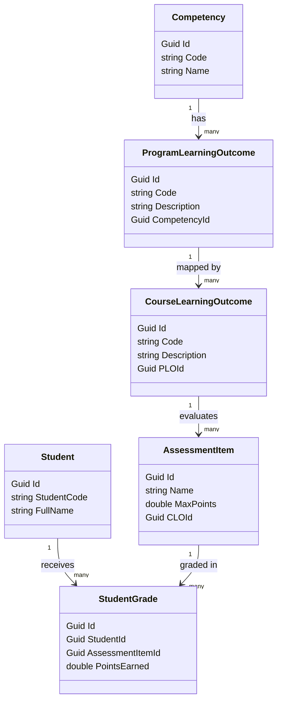

# Tài liệu Nghiên cứu Lý thuyết: Outcome-Based Education (OBE), Learning Outcomes (CLO, PLO) & Competency Framework

Tài liệu này tổng hợp nghiên cứu lý thuyết về phương pháp giáo dục dựa trên chuẩn đầu ra (OBE), hệ thống phân cấp chuẩn đầu ra học phần (CLO) và chương trình (PLO), cùng khung năng lực (Competency Framework). Đây là nền tảng cốt lõi để xây dựng các hệ thống quản lý học tập (LMS) hiện đại và các công cụ đánh giá năng lực học tập cá nhân hóa.

---

## 1. Outcome-Based Education (OBE - Giáo dục dựa trên kết quả đầu ra)

### 1.1. Khái niệm và Triết lý
**Outcome-Based Education (OBE)** là một mô hình giáo dục trong đó toàn bộ quá trình thiết kế chương trình đào tạo, tổ chức giảng dạy, xây dựng học liệu và kiểm tra đánh giá đều xoay quanh việc đảm bảo người học đạt được những năng lực cụ thể sau khi hoàn thành khóa học. 

Khác với giáo dục truyền thống tập trung vào **đầu vào** (input-based: giáo viên dạy những gì, dạy trong bao lâu), OBE tập trung hoàn toàn vào **đầu ra** (output-based: sinh viên có thể làm được những gì thực tế sau khi học).

> **Triết lý của OBE:**
> *Không phải tất cả học sinh đều học theo cùng một cách và cùng một thời điểm, nhưng tất cả học sinh đều có khả năng đạt được kết quả đầu ra mong đợi nếu được trao cơ hội và điều kiện phù hợp.*

### 1.2. Bốn Nguyên lý Cốt lõi của OBE (Spady, 1994)

1. **Tập trung rõ ràng (Clarity of Focus):** Giáo viên và học sinh cần biết chính xác mục tiêu cuối cùng của mỗi bài học/môn học. Mọi hoạt động trên lớp đều phải trực tiếp bổ trợ cho mục tiêu này.
2. **Thiết kế ngược (Design Backwards):** Đây là nguyên lý quan trọng nhất. Quy trình thiết kế chương trình đi từ vĩ mô đến vi mô:
   $$\text{Yêu cầu Xã hội / Khung Năng lực Nghề nghiệp} \longrightarrow \text{PLO (Chương trình)} \longrightarrow \text{CLO (Môn học)} \longrightarrow \text{Bài học \& Đánh giá}$$
3. **Kỳ vọng cao (High Expectations):** Thiết kế chuẩn đầu ra có tính thách thức để khuyến khích sinh viên đạt đến mức độ thành thục cao nhất (Mastery), thay vì chỉ vừa đủ điểm qua môn.
4. **Mở rộng cơ hội (Expanded Opportunities):** Công nhận sự khác biệt về tốc độ tiếp thu của từng cá nhân. Cung cấp nhiều hình thức học tập, làm bài tập bù hoặc kiểm tra lại (Remediation) để người học có thêm cơ hội đạt chuẩn.

---

## 2. Learning Outcomes (Chuẩn đầu ra - CLO & PLO)

Chuẩn đầu ra là các tuyên bố mô tả rõ ràng những gì người học biết, hiểu và có thể làm được khi kết thúc một giai đoạn học tập.

```
                  ┌──────────────────────────────┐
                  │  Competency Framework        │  (Khung năng lực nghề nghiệp)
                  └──────────────┬───────────────┘
                                 │ maps to
                  ┌──────────────▼───────────────┐
                  │  Program Learning Outcomes   │  (PLO - Chuẩn đầu ra Chương trình)
                  │           (PLOs)             │
                  └──────────────┬───────────────┘
                                 │ maps to
                  ┌──────────────▼───────────────┐
                  │   Course Learning Outcomes   │  (CLO - Chuẩn đầu ra Học phần)
                  │           (CLOs)             │
                  └──────────────┬───────────────┘
                                 │ assessed by
                  ┌──────────────▼───────────────┐
                  │      Assessment Items        │  (Bài kiểm tra / Câu hỏi / Rubric)
                  └──────────────────────────────┘
```

### 2.1. PLO (Program Learning Outcomes - Chuẩn đầu ra chương trình đào tạo)
* **Định nghĩa:** Là tập hợp các kiến thức, kỹ năng và thái độ mà sinh viên dự kiến sẽ đạt được khi tốt nghiệp toàn bộ chương trình đào tạo (ví dụ: Cử nhân Công nghệ thông tin).
* **Số lượng:** Thường từ 10 - 15 PLO cho một chương trình đào tạo để đảm bảo tính bao quát nhưng vẫn dễ đo lường.
* **Ví dụ:** *"PLO 3: Có khả năng thiết kế và phát triển các hệ thống phần mềm phân tán quy mô lớn sử dụng kiến trúc microservices và giao tiếp hướng sự kiện."*

### 2.2. CLO (Course Learning Outcomes - Chuẩn đầu ra học phần)
* **Định nghĩa:** Là những kiến thức và kỹ năng chi tiết mà sinh viên đạt được sau khi học xong một môn học cụ thể (ví dụ: Môn học "Lập trình .NET nâng cao").
* **Cách xây dựng (Thang đo nhận thức Bloom - Bloom's Taxonomy):** Mỗi CLO phải bắt đầu bằng một **động từ hành động** để có thể đo lường và đánh giá một cách định lượng.

| Cấp độ Bloom | Mô tả | Động từ hành động mẫu | Ví dụ CLO tương ứng |
| :--- | :--- | :--- | :--- |
| **1. Nhớ (Remember)** | Tái hiện, nhận diện kiến thức | Định nghĩa, Liệt kê, Kể tên | Liệt kê các thành phần chính của một kiến trúc Microservices. |
| **2. Hiểu (Understand)** | Giải thích ý nghĩa, tóm tắt | Giải thích, Phân biệt, Tóm tắt | Giải thích sự khác biệt giữa giao tiếp đồng bộ gRPC và bất đồng bộ qua RabbitMQ. |
| **3. Áp dụng (Apply)** | Sử dụng kiến thức vào thực tế | Triển khai, Xây dựng, Tính toán | Triển khai JWT Authentication trong ứng dụng ASP.NET Core API. |
| **4. Phân tích (Analyze)** | Chia nhỏ thông tin, tìm mối quan hệ | Phân tích, So sánh, Tối ưu | Phân tích hiệu năng của truy vấn Entity Framework Core bằng SQL Profiler. |
| **5. Đánh giá (Evaluate)** | Phán quyết, đưa ra nhận định | Đánh giá, Phê bình, Lựa chọn | Đánh giá kiến trúc hệ thống hiện tại và đề xuất giải pháp API Gateway phù hợp. |
| **6. Sáng tạo (Create)** | Thiết kế, tạo ra sản phẩm mới | Thiết kế, Sáng tác, Phát triển | Thiết kế một hệ thống chấm điểm tự động tích hợp OBE Engine. |

### 2.3. Ma trận ánh xạ (Mapping Matrix)
Trong OBE, tính liên kết chặt chẽ được thể hiện qua ma trận ánh xạ. Mỗi môn học đóng góp vào một hoặc nhiều PLO của chương trình.

* **Ma trận CLO-to-PLO:** Xác định CLO đóng đóng góp bao nhiêu phần trăm (%) hoặc theo mức độ (I - Introduce, R - Reinforce, M - Mastery) vào PLO.
* **Ma trận Assessment-to-CLO:** Mỗi câu hỏi trong đề thi (Quiz Question), tiêu chí chấm điểm (Rubric Item) của đồ án đều phải được gắn (tag) với ít nhất một CLO cụ thể.

---

## 3. Khung Năng lực (Competency Framework)

### 3.1. Định nghĩa
**Khung năng lực (Competency Framework)** là một cấu trúc định nghĩa các kiến thức, kỹ năng, hành vi và thái độ cần thiết để một cá nhân thực hiện hiệu quả một vai trò hoặc một công việc cụ thể trong doanh nghiệp hay ngành nghề (ví dụ: Khung năng lực của một .NET Backend Engineer).

### 3.2. Mô hình KSA (Knowledge - Skills - Attitude)
Khung năng lực thường được xây dựng dựa trên 3 trụ cột chính:
* **Knowledge (Kiến thức - Biết gì):** Hiểu biết lý thuyết, nguyên lý làm việc (ví dụ: Hiểu nguyên lý hoạt động của cơ chế Garbage Collection trong CLR).
* **Skills (Kỹ năng - Làm được gì):** Khả năng thực hành, áp dụng công cụ để giải quyết công việc (ví dụ: Viết truy vấn LINQ tối ưu, cấu hình Docker Compose).
* **Attitude (Thái độ - Hành xử thế nào):** Đạo đức nghề nghiệp, khả năng làm việc nhóm, tinh thần tự học hỏi (ví dụ: Tuân thủ quy trình code review, chủ động nghiên cứu công nghệ mới).

### 3.3. Phân biệt Competency (Năng lực) và Learning Outcome (Chuẩn đầu ra)

| Tiêu chí | Competency (Năng lực) | Learning Outcome (Chuẩn đầu ra) |
| :--- | :--- | :--- |
| **Bối cảnh sử dụng** | Gắn liền với công việc, nghề nghiệp thực tế và doanh nghiệp. | Gắn liền với môi trường học thuật, chương trình đào tạo tại nhà trường. |
| **Phạm vi** | Rộng và mang tính tích hợp dài hạn (Ví dụ: Năng lực giải quyết vấn đề kỹ thuật phức tạp). | Cụ thể, định lượng và giới hạn thời gian (Ví dụ: Viết được API CRUD sau 2 tuần). |
| **Cách đo lường** | Đánh giá thông qua hành vi thực tế tại nơi làm việc và kết quả công việc. | Đánh giá qua điểm số bài tập lớn, bài thi, đồ án tốt nghiệp. |

---

## 4. Công thức & Cơ chế đo lường độ đạt chuẩn OBE (Attainment Calculation)

Để kiểm chứng tính hiệu quả của giáo dục OBE, hệ thống LMS/OBE Engine cần tự động tính toán mức độ đạt chuẩn của người học dựa trên dữ liệu đánh giá thực tế.

### 4.1. Cách tính độ đạt được của CLO (CLO Attainment)
Giả sử sinh viên $S$ thực hiện các bài đánh giá có chứa các câu hỏi ánh xạ đến $CLO_j$.
$$\text{CLO Attainment (\%)} = \frac{\sum \text{Điểm đạt được của các câu hỏi thuộc } CLO_j}{\sum \text{Điểm tối đa của các câu hỏi thuộc } CLO_j} \times 100$$

*Ví dụ:* Một bài kiểm tra có 3 câu hỏi liên quan đến $CLO_1$:
* Câu 1: Đạt $8/10$ điểm
* Câu 2: Đạt $4/5$ điểm
* Câu 3: Đạt $6/10$ điểm
$$\text{CLO}_1 \text{ Attainment} = \frac{8 + 4 + 6}{10 + 5 + 10} \times 100 = \frac{18}{25} \times 100 = 72\%$$

### 4.2. Cách tính độ đạt được của PLO (PLO Attainment)
Một PLO được đóng góp bởi nhiều CLO từ các môn học khác nhau với trọng số (Weight) được xác định trước trong chương trình đào tạo.
$$\text{PLO}_k \text{ Attainment (\%)} = \frac{\sum_{i=1}^{n} \left( \text{CLO}_i \text{ Attainment} \times W_{ik} \right)}{\sum_{i=1}^{n} W_{ik}}$$
Trong đó:
* $\text{CLO}_i \text{ Attainment}$ là kết quả đạt được của môn học $i$.
* $W_{ik}$ là trọng số đóng góp của $\text{CLO}_i$ vào $\text{PLO}_k$.

### 4.3. Phân cấp mức độ năng lực (Competency Level)
Dựa trên tỉ lệ đạt được của PLO/Competency, hệ thống sẽ phân loại năng lực của người học:
* **Mức độ Mastered (Thành thục):** $\ge 75\%$ - Sinh viên làm chủ hoàn toàn năng lực.
* **Mức độ Developing (Đang phát triển):** Từ $50\%$ đến dưới $75\%$ - Sinh viên cần rèn luyện thêm một số kỹ năng nhỏ.
* **Mức độ Beginning (Mới bắt đầu - Cần Remediation):** Dưới $50\%$ - Sinh viên bị hổng kiến thức nghiêm trọng, hệ thống tự động đưa vào danh sách Remediation (học bù/cải thiện).

---

## 5. Thiết kế Hệ thống OBE Evaluation Engine (Demo Concept)

Nhằm mục đích minh họa thực tế cho phần lý thuyết trên, chúng ta sẽ xây dựng một dự án demo .NET 8 Web API mang tên **ObeEvaluationSystem**.

### Kiến trúc Database & Lớp Dữ liệu (SQLite & EF Core):


Hệ thống API này sẽ thực hiện:
1. Seed cơ sở dữ liệu mẫu về các chuẩn đầu ra ngành công nghệ thông tin (Software Engineering).
2. Tính toán chi tiết phần trăm đạt được của từng CLO, PLO, và mức độ xếp loại Khung Năng lực của một sinh viên cụ thể.
3. Tự động gợi ý các CLO bị hổng (dưới 50%) cần cải thiện (Remediation Recommendation).
