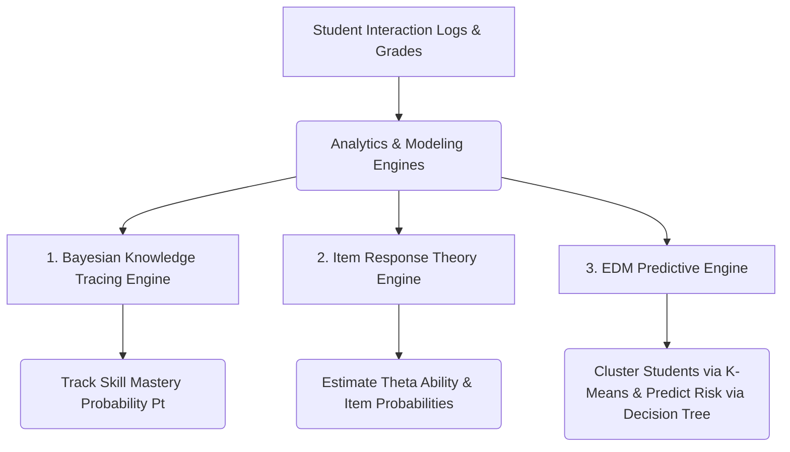

# Tài liệu Nghiên cứu Lý thuyết: Competency Assessment, Learning Analytics, Student Modeling & Educational Data Mining (EDM)

Tài liệu này nghiên cứu chuyên sâu về các phương pháp khoa học dữ liệu và mô hình hóa trong giáo dục hiện đại. Đây là giai đoạn tiếp theo của mô hình OBE (Outcome-Based Education) nhằm cá nhân hóa việc học thông qua việc phân tích dữ liệu tương tác, đo lường năng lực thực tế, dự báo rủi ro học tập và mô hình hóa trạng thái tri thức của người học.

---

## 1. Competency Assessment (Đánh giá năng lực)

### 1.1. Khái niệm Đánh giá Năng lực
Khác với đánh giá kiến thức truyền thống (thường chỉ đo lường khả năng ghi nhớ qua các bài thi trắc nghiệm lý thuyết), **Đánh giá Năng lực (Competency Assessment)** tập trung vào việc đo lường mức độ người học có thể vận dụng tổng hòa các yếu tố Kiến thức (Knowledge), Kỹ năng (Skills) và Thái độ (Attitude) để giải quyết các vấn đề thực tế trong những bối cảnh cụ thể.

### 1.2. Đánh giá đa chiều qua Rubrics (Multidimensional Assessment)
Để đánh giá năng lực một cách khách quan và chính xác, các nhà giáo dục sử dụng **Rubrics** - một bộ hướng dẫn chấm điểm mô tả chi tiết các tiêu chí và mức độ thực hiện công việc. Một Rubric đánh giá năng lực chuẩn bao gồm:
*   **Criteria (Tiêu chí đánh giá):** Các khía cạnh khác nhau của năng lực cần đo lường. Ví dụ, để đánh giá năng lực "Phát triển Phần mềm Backend", tiêu chí có thể gồm: *Thiết kế cơ sở dữ liệu*, *Chất lượng mã nguồn (Clean Code)*, và *Xử lý ngoại lệ & Bảo mật*.
*   **Performance Levels (Mức độ hoàn thành):** Thể hiện cấp độ từ thấp đến cao (ví dụ: *Beginning* $\rightarrow$ *Developing* $\rightarrow$ *Mastered*).
*   **Descriptors (Mô tả chi tiết):** Các chỉ báo hành vi cụ thể ứng với từng tiêu chí ở mỗi mức độ hoàn thành để giảm thiểu sự cảm tính của người chấm.
*   **Weight (Trọng số):** Mức độ quan trọng của từng tiêu chí trong tổng thể năng lực.

### 1.3. Đánh giá Thích ứng (Adaptive Assessment)
Là phương pháp kiểm tra trong đó độ khó của câu hỏi tiếp theo được điều chỉnh tự động dựa trên câu trả lời của câu hỏi trước đó. Nếu người học trả lời đúng, hệ thống sẽ đưa ra câu hỏi khó hơn; nếu trả lời sai, hệ thống sẽ đưa ra câu hỏi dễ hơn nhằm tìm ra chính xác ranh giới năng lực tối đa của người học mà không gây chán nản hoặc quá tải.

---

## 2. Learning Analytics (LA - Phân tích học tập)

### 2.1. Định nghĩa và Mục tiêu
**Learning Analytics (LA)** là việc đo lường, thu thập, phân tích và báo cáo dữ liệu về người học và bối cảnh của họ, nhằm mục đích hiểu rõ và tối ưu hóa việc học tập cũng như môi trường diễn ra hoạt động đó (LAK, 2011).

### 2.2. Bốn cấp độ của Phân tích Học tập
Theo mô hình trưởng thành của Gartner áp dụng vào giáo dục:
1.  **Descriptive Analytics (Phân tích Mô tả):** "Cái gì đã xảy ra?" (Ví dụ: Thống kê số giờ học, số lần click chuột, điểm trung bình của sinh viên trên LMS).
2.  **Diagnostic Analytics (Phân tích Chẩn đoán):** "Tại sao nó xảy ra?" (Ví dụ: Nhận diện sinh viên đạt điểm kém là do họ có thời gian xem bài giảng video dưới 10% mức trung bình).
3.  **Predictive Analytics (Phân tích Dự đoán):** "Cái gì sẽ xảy ra?" (Ví dụ: Sử dụng các mô hình máy học để dự báo sinh viên có nguy cơ bỏ học hoặc trượt môn cao dựa trên hành vi tuần đầu).
4.  **Prescriptive Analytics (Phân tích Đề xuất):** "Cần làm gì để cải thiện?" (Ví dụ: Hệ thống tự động đề xuất lộ trình ôn tập bổ sung khi phát hiện lỗ hổng kiến thức).

### 2.3. Các chỉ số tương tác chính (Engagement Metrics)
Dữ liệu thô từ hệ thống LMS được tổng hợp thành các chỉ số hành vi:
*   **Time-on-task:** Tổng thời gian sinh viên thực sự tương tác với học liệu.
*   **Consistency Score (Độ đều đặn):** Độ lệch chuẩn của khoảng thời gian giữa các lần đăng nhập. Một điểm số đều đặn cao cho thấy thói quen học tập lành mạnh.
*   **Submission Latency (Độ trễ nộp bài):** Khoảng thời gian nộp bài so với hạn chót (Deadline). Nộp bài sát deadline hoặc trễ hạn thường tương quan nghịch với kết quả học tập.
*   **Interactivity Density (Mật độ tương tác):** Số lượng câu hỏi thử nghiệm, bài đăng thảo luận được thực hiện trên mỗi đơn vị thời gian.

---

## 3. Student Modeling (Mô hình hóa người học)

**Student Modeling** là quá trình xây dựng một biểu diễn số học (chứa trạng thái kiến thức, hành vi, cảm xúc, sở thích) của người học. Hai mô hình toán học kinh điển nhất được áp dụng rộng rãi trong các hệ thống học tập thích ứng (Adaptive Learning) là **Bayesian Knowledge Tracing (BKT)** và **Item Response Theory (IRT)**.

### 3.1. Bayesian Knowledge Tracing (BKT)
BKT là một mô hình Chuỗi Markov ẩn (Hidden Markov Model) dùng để theo dõi sự thay đổi trạng thái tri thức của người học qua từng lượt thực hành đối với một kỹ năng cụ thể.

#### 3.1.1. Các tham số của BKT:
Mỗi kỹ năng (Skill) được định nghĩa bởi 4 tham số xác suất ban đầu:
*   $P(L_0)$ (Initial Knowledge): Xác suất sinh viên đã làm chủ kỹ năng trước khi làm bài tập đầu tiên.
*   $P(T)$ (Transition): Xác suất sinh viên học được kỹ năng mới sau một cơ hội thực hành (dù câu trả lời trước đó đúng hay sai).
*   $P(G)$ (Guess): Xác suất sinh viên trả lời đúng câu hỏi dù chưa thực sự làm chủ kỹ năng (đoán bừa).
*   $P(S)$ (Slip): Xác suất sinh viên trả lời sai dù đã làm chủ kỹ năng (sơ suất, bất cẩn).

```
   Chưa làm chủ (Unlearned) ───────── P(T) ─────────► Đã làm chủ (Learned)
          │                                                  │
    ┌─────┴─────┐                                      ┌─────┴─────┐
    │           │                                      │           │
  P(G)        1-P(G)                                 1-P(S)       P(S)
    ▼           ▼                                      ▼           ▼
 Đúng (C)    Sai (I)                                Đúng (C)    Sai (I)
```

#### 3.1.2. Công thức cập nhật xác suất tri thức:
Khi sinh viên thực hiện một bài tập liên quan đến kỹ năng đó, hệ thống ghi nhận kết quả (Đúng hoặc Sai) và cập nhật xác suất làm chủ kỹ năng hiện tại $P(L_{t-1})$ thành $P(L_t)$ theo 2 bước:

**Bước 1: Tính xác suất làm chủ có điều kiện dựa trên hành vi thực tế:**
*   Nếu sinh viên trả lời **ĐÚNG** (Correct):
    $$P(L_{t-1} | Correct) = \frac{P(L_{t-1}) \cdot (1 - P(S))}{P(L_{t-1}) \cdot (1 - P(S)) + (1 - P(L_{t-1})) \cdot P(G)}$$
*   Nếu sinh viên trả lời **SAI** (Incorrect):
    $$P(L_{t-1} | Incorrect) = \frac{P(L_{t-1}) \cdot P(S)}{P(L_{t-1}) \cdot P(S) + (1 - P(L_{t-1})) \cdot (1 - P(G))}$$

**Bước 2: Tính đến khả năng học hỏi sau cơ hội thực hành (Transition):**
$$P(L_t) = P(L_{t-1} | Action) + (1 - P(L_{t-1} | Action)) \cdot P(T)$$

*Khi $P(L_t) \ge 0.95$, hệ thống coi như sinh viên đã đạt mức độ thành thục hoàn toàn (Mastery).*

---

### 3.2. Item Response Theory (IRT - Lý thuyết Ứng đáp Câu hỏi)
Khác với điểm số cổ điển (Classical Test Theory - tính tổng số câu đúng), IRT liên kết xác suất trả lời đúng một câu hỏi cụ thể với **năng lực tiềm ẩn của người học** và **đặc tính của câu hỏi**.

#### 3.2.1. Mô hình Rasch (1PL - One Parameter Logistic Model):
Chỉ xem xét độ khó của câu hỏi. Xác suất sinh viên $i$ có năng lực $\theta_i$ trả lời đúng câu hỏi $j$ có độ khó $b_j$ là:
$$P(X_{ij} = 1 | \theta_i, b_j) = \frac{1}{1 + e^{-(\theta_i - b_j)}}$$

#### 3.2.2. Mô hình 2PL (Two Parameter Logistic Model):
Bổ sung thêm tham số độ phân biệt của câu hỏi ($a_j$):
$$P(X_{ij} = 1 | \theta_i, a_j, b_j) = \frac{1}{1 + e^{-a_j(\theta_i - b_j)}}$$

Trong đó:
*   $\theta_i$ (Ability): Năng lực của người học, thường nằm trong khoảng $[-3, +3]$. Giá trị càng cao năng lực càng lớn.
*   $b_j$ (Difficulty): Độ khó của câu hỏi $j$, cùng thang đo với $\theta$. Nếu câu hỏi có độ khó bằng năng lực sinh viên ($\theta_i = b_j$), xác suất trả lời đúng là $50\%$.
*   $a_j$ (Discrimination): Độ phân biệt của câu hỏi. Giá trị càng lớn chứng tỏ câu hỏi phân tách càng rõ sinh viên giỏi và sinh viên yếu.

```
Xác suất Đúng (P)
  1.0 ┼               /
      │             /   
  0.5 ┼───────────/────── (θ = b)
      │         /
  0.0 ┼───────/──────────
     -3      0      +3   Năng lực (θ)
```

---

## 4. Educational Data Mining (EDM - Khai phá dữ liệu giáo dục)

### 4.1. Sự khác biệt giữa EDM và Learning Analytics
Mặc dù đều xử lý dữ liệu giáo dục, EDM và LA có những định hướng nghiên cứu khác nhau:
*   **EDM:** Tập trung vào việc phát triển các thuật toán và mô hình kỹ thuật (thường mang tính tự động hóa và khai phá dữ liệu sâu) để tìm ra các mẫu ẩn mới trong dữ liệu lớn.
*   **Learning Analytics:** Tập trung nhiều hơn vào việc hiển thị thông tin trực quan, hỗ trợ giảng viên/nhà quản lý đưa ra quyết định sư phạm và cải thiện trực tiếp trải nghiệm người học.

### 4.2. Các bài toán EDM thực tế
1.  **Phân cụm sinh viên (Student Clustering):**
    *   **Mục tiêu:** Gom nhóm sinh viên tự động dựa trên hành vi mà không cần nhãn trước.
    *   **Thuật toán:** K-Means.
    *   **Ứng dụng:** Chia lớp học thành 3 cụm: *Cụm 1: Tự giác học tập cao*, *Cụm 2: Thụ động (chỉ học sát kỳ thi)*, *Cụm 3: Nguy cơ cao (ít đăng nhập, làm bài điểm thấp)* để giáo viên có phương án hỗ trợ kịp thời.
2.  **Dự báo kết quả học tập (Academic Prediction):**
    *   **Mục tiêu:** Dự đoán khả năng sinh viên bỏ học hoặc trượt môn ngay trong quá trình học.
    *   **Thuật toán:** Cây quyết định (Decision Trees) - giúp giảng viên dễ dàng giải thích kết quả dự đoán thông qua các luật "IF-THEN".
    *   **Mẫu quy tắc Cây quyết định:**
        *   `IF Time-on-task < 5 hours AND Quiz-Score < 50% THEN Status = AtRisk`
        *   `IF Submission-Latency > 24 hours AND Consistency-Score < 0.3 THEN Status = Borderline`
3.  **Khai phá chuỗi hành vi học tập (Sequential Pattern Mining):**
    *   Phát hiện các lộ trình/trình tự học tập dẫn đến điểm cao hoặc điểm thấp. Ví dụ: Phát hiện quy luật *"Đọc lý thuyết $\rightarrow$ Xem video thực hành $\rightarrow$ Làm quiz"* đem lại tỉ lệ đỗ cao hơn $40\%$ so với *"Làm quiz ngay $\rightarrow$ Xem đáp án"*.

---

## 5. Thiết kế Hệ thống Demo: Smart Learning Analytics Engine

Để minh họa cho các mô hình lý thuyết trên, chúng ta sẽ xây dựng dự án **SmartLearningAnalyticsSystem** bằng **.NET 8** sử dụng SQLite. Dự án sẽ chứa các module cốt lõi sau:



1.  **BKT Engine:** Nhận lịch sử làm bài tập của sinh viên cho một Skill (ví dụ: "SQL Join"), tự động cập nhật và trả về biểu đồ tiến trình xác suất làm chủ của sinh viên qua các lượt thử.
2.  **IRT Engine:** Tính toán độ khó thực tế của câu hỏi dựa trên câu trả lời của đám đông, đồng thời ước lượng năng lực $\theta$ của một sinh viên cụ thể.
3.  **EDM Predictive Engine:**
    *   Triển khai thuật toán **K-Means Clustering** mô phỏng để phân cụm sinh viên dựa trên 2 đặc trưng: `TotalStudyTime` và `AssignmentScore`.
    *   Triển khai một **Decision Tree Classifier** mô phỏng để phân loại nguy cơ học tập (`Safe`, `Borderline`, `AtRisk`).
4.  **Learning Analytics Dashboard API:** Cung cấp báo cáo phân tích tổng quan cho từng sinh viên bao gồm các chỉ số `ConsistencyScore`, `EngagementScore` và đề xuất học tập.
