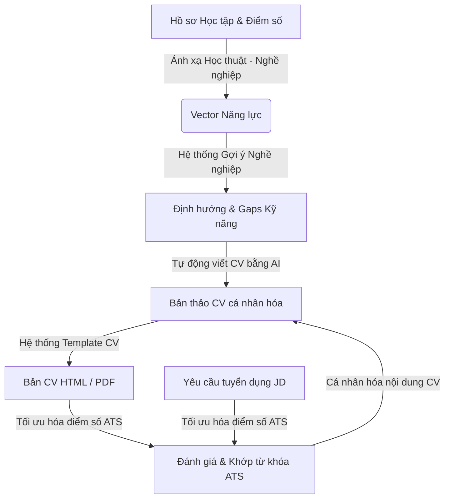

# Hệ thống Tối ưu CV bằng AI & Gợi ý Nghề nghiệp: Khung lý thuyết và Thiết kế

Tài liệu này trình bày chi tiết các khái niệm cốt lõi, kiến trúc giải thuật và thiết kế triển khai cho nền tảng gợi ý nghề nghiệp và xây dựng CV tích hợp AI. Hệ thống giúp thu hẹp khoảng cách giữa đào tạo học thuật đại học và yêu cầu thực tế của doanh nghiệp bằng cách tự động hóa quy trình viết CV, tối ưu hóa điểm số ATS và ánh xạ định hướng nghề nghiệp.

---

## 🗺️ 1. Khung Khái niệm & 6 Module Cốt lõi

### 1.1. Tự động viết CV bằng AI (Phương pháp STAR & XYZ)
Viết CV chuyên nghiệp đòi hỏi các gạch đầu dòng (bullet points) mô tả kinh nghiệm phải tập trung vào kết quả và tầm ảnh hưởng thực tế thay vì liệt kê nhiệm vụ thụ động. Module này sử dụng mẫu cấu trúc tự động dựa trên **Công thức XYZ của Google**:
$$\text{Đạt được [X], đo lường bằng [Y], bằng cách thực hiện [Z]}$$

- **X (Hành động & Kết quả đạt được)**: Thiết kế, nâng cấp, tối ưu hóa, giảm thiểu.
- **Y (Chỉ số đo lường/Kết quả)**: e.g., "giảm 35% độ trễ truy vấn", "tăng 15% hiệu năng hệ thống".
- **Z (Công nghệ & Bối cảnh thực hiện)**: e.g., "bằng cách tích hợp FastAPI endpoints và tối ưu hóa chỉ mục (indexing) cơ sở dữ liệu SQL".

Bộ sinh nội dung chuyển đổi các mô tả thô sơ, lộn xộn của sinh viên thành các câu chuẩn cấu trúc STAR (Situation - Tình huống, Task - Nhiệm vụ, Action - Hành động, Result - Kết quả) có sức thuyết phục cao.

### 1.2. Hệ thống Template CV (Resume Template Generation)
Một hệ thống mẫu CV hiện đại cần tách biệt hoàn toàn nội dung dữ liệu và cách trình bày. Hệ thống hỗ trợ các mẫu giao diện động:
*   **Modern Slate (Hiện đại/Nổi bật)**: Bố cục độ tương phản cao, chuyên nghiệp, sử dụng các dải màu tối làm điểm nhấn cho ứng viên ngành kỹ thuật.
*   **Minimalist Professional (Tối giản)**: Thiết kế đen trắng truyền thống tập trung vào kiểu chữ và khoảng cách sạch sẽ, phù hợp khối ngành kinh tế/văn phòng.
*   **Academic Curriculum Vitae (Học thuật)**: Mẫu nhiều trang hướng tới nghiên cứu khoa học, nhấn mạnh vào các bài báo xuất bản, hoạt động giảng dạy và danh sách môn học hàn lâm.

Các mẫu này được cấu trúc bằng HTML ngữ nghĩa kết hợp các quy tắc CSS Print chuyên sâu để đảm bảo định dạng chính xác 100% theo chuẩn giấy A4 khi in ấn hoặc xuất bản PDF thông qua `@media print`.

### 1.3. Tối ưu hóa điểm số ATS (ATS Resume Optimization)
Hệ thống theo dõi ứng viên (ATS) quét CV dựa trên mật độ từ khóa và định dạng bố cục. Quy trình xử lý của hệ thống gồm:
1.  **Trích xuất từ khóa (Keyword Extraction)**: Phân tách từ khóa của Job Description (JD), loại bỏ từ dừng (stop words) và chuẩn hóa từ. Trích xuất các thuật ngữ cốt lõi sử dụng giải thuật trọng số TF-IDF:
    $$\text{Score}(t) = \text{TF}(t) \times \log\left(1 + \frac{N}{\text{DF}(t)}\right)$$
2.  **Phân tích CV (Resume Parsing)**: Kiểm tra nội dung CV của ứng viên để tìm kiếm từ khóa tương ứng hoặc bị thiếu.
3.  **Công thức chấm điểm ATS (ATS Scoring Metric)**: Tính toán điểm tổng hợp ($S_{\text{ATS}}$) dựa trên các tiêu chí:
    *   **Khớp từ khóa ($W_{\text{kw}} = 0.50$)**: Tỷ lệ phần trăm từ khóa quan trọng trong JD xuất hiện trong CV.
    *   **Định dạng Cấu trúc ($W_{\text{str}} = 0.20$)**: Sự hiện diện của các mục chính bắt buộc (Kinh nghiệm, Học vấn, Kỹ năng).
    *   **An toàn Định dạng ($W_{\text{fmt}} = 0.15$)**: Điểm cộng khi tránh dùng bảng biểu phức tạp, hình vẽ dạng khối hoặc ký tự đặc biệt gây lỗi bộ đọc văn bản của ATS.
    *   **Độ dài & Mật độ ($W_{\text{len}} = 0.15$)**: Số lượng từ tối ưu (khoảng 300-800 từ) và số dòng gạch đầu dòng hợp lý.

### 1.4. Cá nhân hóa nội dung CV (Personalized Resume Generation)
Khác với CV chung chung, CV cá nhân hóa tự động điều chỉnh nội dung hiển thị dựa vào vai trò công việc mục tiêu:
*   **Sắp xếp lại Kỹ năng**: Đẩy các kỹ năng liên quan nhất lên trên đầu (ví dụ: đẩy Docker, PostgreSQL lên trước cho vị trí Backend; đẩy React, CSS lên trước cho vị trí Frontend).
*   **Cá nhân hóa Kinh nghiệm**: Lọc và chỉ hiển thị các câu gạch đầu dòng STAR tương thích chặt chẽ nhất với vị trí công việc ứng tuyển.

### 1.5. Ánh xạ Học thuật - Nghề nghiệp (Academic-to-Career Mapping)
Sinh viên thường gặp khó khăn khi chuyển dịch các môn học hàn lâm tại trường thành năng lực làm việc thực tế. Module này ánh xạ các môn học đại học sang các Trục Năng lực Nghề nghiệp sử dụng Đồ thị có hướng (Directed Graph):
*   **Nút (Nodes)**: Các môn học (e.g., *CS-101: Cấu trúc dữ liệu & Giải thuật*) và Trục Năng lực (e.g., *Tối ưu hóa giải thuật*).
*   **Cạnh (Edges)**: Các liên kết có hướng đi kèm trọng số thể hiện mức độ đóng góp năng lực (từ 0.0 đến 1.0).
*   *Ví dụ*:
    $$\text{Cấu trúc dữ liệu} \xrightarrow{0.8} \text{Tối ưu giải thuật} \xrightarrow{0.9} \text{Kỹ sư Backend}$$
    $$\text{Thực hành Công nghệ} \xrightarrow{0.7} \text{Làm việc nhóm & Git} \xrightarrow{0.8} \text{Kỹ sư DevOps}$$

### 1.6. Hệ thống Gợi ý Nghề nghiệp (Career Recommendation System)
Dựa vào điểm số các môn học đại học của sinh viên, hệ thống xây dựng **Vector Năng lực Sinh viên** $\vec{S}$. So khớp vector này với **Vector Yêu cầu Công việc** $\vec{C}_j$ của từng vị trí nghề nghiệp định nghĩa trước bằng công thức Tương đồng Cosine:
$$\text{Similarity}(\vec{S}, \vec{C}_j) = \frac{\vec{S} \cdot \vec{C}_j}{\|\vec{S}\| \|\vec{C}_j\|} = \frac{\sum_{i=1}^{n} S_i C_{ji}}{\sqrt{\sum_{i=1}^{n} S_i^2} \sqrt{\sum_{i=1}^{n} C_{ji}^2}}$$

Hệ thống đề xuất các vị trí công việc có điểm tương đồng cao nhất và liệt kê chi tiết "Khoảng cách Kỹ năng" (Skill Gaps) khi $C_{ji} - S_i > \epsilon$, đồng thời gợi ý lộ trình hành động sư phạm cụ thể để sinh viên cải thiện.

---

## 🛠️ 2. Thiết kế Kiến trúc Dự án Demo Tinh gọn

Nhằm tối ưu hóa cho mục đích nghiên cứu nhanh và trực quan hóa thuật toán, dự án được triển khai dưới dạng **Ứng dụng Console Python (`src/main.py`)** chạy độc lập trong môi trường Docker:

1.  **In-Memory Graph & Vector Engine**: Toàn bộ dữ liệu về môn học, trọng số đồ thị năng lực, và vector hồ sơ nghề nghiệp được lưu trữ trong cấu trúc RAM sạch của Python, giúp mã nguồn tường minh và dễ theo dõi.
2.  **Thuật toán so khớp thuần Python**: Trực quan hóa chi tiết các bước tính toán Cosine Similarity và TF-IDF trích xuất từ khóa mà không che giấu logic đằng sau thư viện bên thứ ba.
3.  **Tự động xuất bản CV HTML**: Ghi kết quả tối ưu hóa trực tiếp ra file giao diện [resume_output.html](./src/resume_output.html) trên máy chủ để xem nhanh và in ấn PDF A4 ngay trên trình duyệt.
